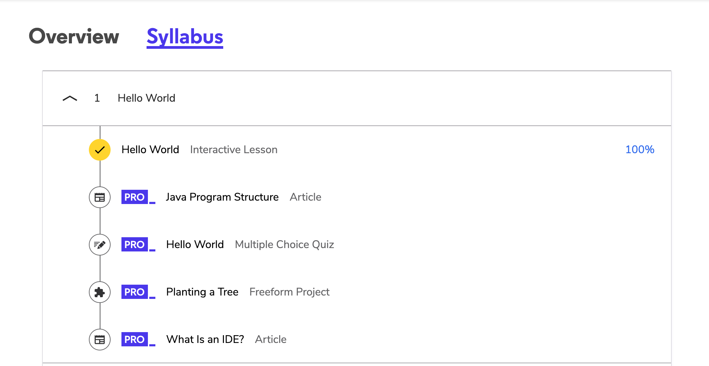

# Java-HW-W1D1

1. https://www.codecademy.com/courses/learn-java/lessons/hello-world-java (Links to an external site.)

2. Familiarize yourself with Intellij (community edition)- Completed 

3. Write a Java program that takes two numbers as input and display the product of two numbers.
https://data-flair.training/blogs/read-java-console-input/ (Links to an external site.)
Angel prefers to use the scanner class in Java. - Completed 

Example:
Input first number: 25
Input second number: 5
Expected Output: 25 x 5 = 125

4. Write a Java program that reads a number in inches, converts it to meters.
Note: One inch is 0.0254 meter. Example: Input a value for inch: 1000 Expected Output: 1000.0 inch is 25.4 meters - Completed